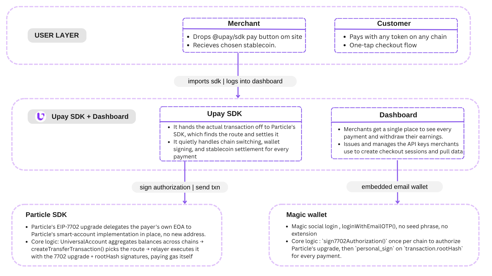

# UPay

**Any coin. Any chain. One button. | The Pay Button for Crypto, Powered by
Particle Universal Accounts**

## Table of Contents

- [Description](#description)
- [Problem Statement](#problem-statement)
- [Features](#features)
- [High Level Architecture](#high-level-architecture)
- [Links](#links)
- [Future Vision](#future-vision)
- [Team](#team)

## Description

UPay is a drop-in crypto checkout, one button, any coin, any chain, one tap. Powered by Particle Network Universal Accounts in EIP-7702 mode, it upgrades the customer's existing wallet in place and settles the merchant in the exact stablecoin and chain they want. The Stripe of crypto, made possible by chain abstraction.

## Problem Statement

### 1. Fragmented Liquidity

Customers hold assets scattered across a dozen chains and wallets, no single merchant can support them all.

### 2. Bridge Fatigue

Manually bridging, swapping, and switching networks before paying kills conversion and trust.

### 3. No Native Crypto Checkout

No simple, native way for merchants to accept crypto, just clunky plugins and processors.

## Features

### 1. One-Tap Checkout

Pay with whatever you hold, on whatever chain it lives on. No bridging, no network switching, no chain selection screen.

### 2. Drop-In Pay Button

`<UPayButton />` — a Stripe-style component a merchant embeds on any storefront in minutes, no custom checkout flow to build.

### 3. Merchant-Defined Settlement

The merchant sets their settlement token and chain once. Every payment lands exactly there, on-chain, automatically.

## High Level Architecture

## Links

- Deployed URL: [tryupay.xyz](https://tryupay.xyz)
- SDK : [@alphadevs_labs/upay-sdk](https://www.npmjs.com/package/@alphadevs_labs/upay-sdk)
- Demo Store: [demo.tryupay.xyz](https://demo.tryupay.xyz)
- Demo Video: _<!-- paste demo video URL here -->_
- Presentation: [https://canva.link/607negv86vgh2kc](https://canva.link/607negv86vgh2kc)

## Future Vision

### 1. Production Foundation

Hardened SDK, API-key auth, webhooks, mainnet rollout, and a recurring payments primitive — onboarding the first real design partners and transaction volume.

### 2. Product Depth

Multi-recipient payouts, a hosted invoicing product, e-commerce plugins (Shopify/WooCommerce), and merchant KYB/compliance groundwork.

### 3. Scale & Rails

Fiat settlement via off-ramp partners, vertical playbooks for gaming/creators/DePIN, and agent-payable checkouts as autonomous agents begin paying through their own Universal Accounts.

## Team

Built by **Team AlphaDevs** for the Umaxx Hackathon.
